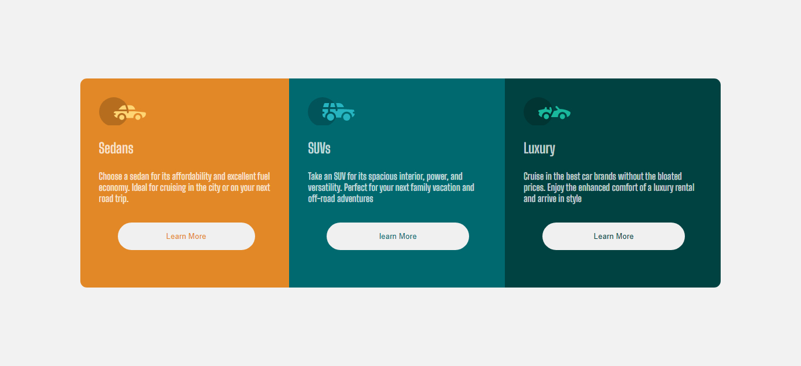

# 3 Columb  Preview Card

## This is an assignment, gotten from frontend mentor, it aim at improving my dev skill as a new be. the project was all about designing a 3 columb preview card, using HTML and CSS. The code was done, using diffrent HTML samantic tags for building the layout, and the styling was done using CSS flex box.

## it was not easy, but making more research , I was able to complect it.    The challenge I face, was making the project responsive

## The project was done, using the fooling tools
### 1 HTML
### 2 CSS
### 3 @CSS media query

## the result from the finished project
   

 

